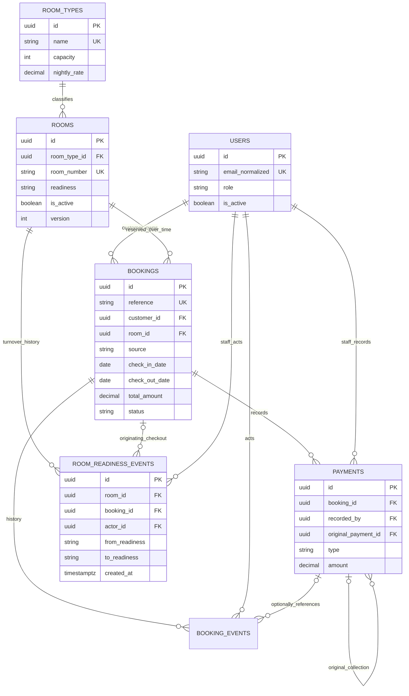
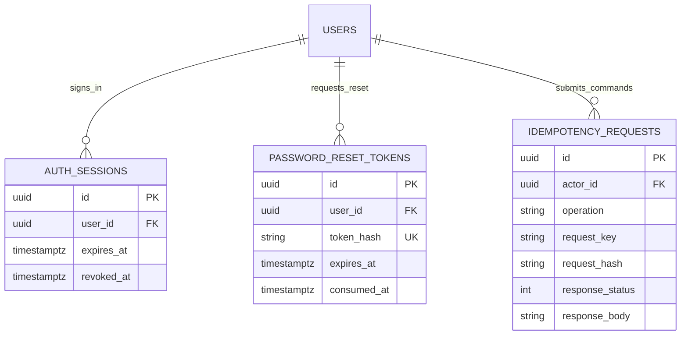

# InnSync — Database Relationships

> PostgreSQL relationships for customer-created online bookings and hotel stay operations.

The complete logical field/key schema is [schema.dbml](schema.dbml). The schema is a design artifact, not an executed migration. Business behavior is defined in [Business Rules](BUSINESS-RULES.md).

## Scope

There are **seven business tables and three supporting tables**:

| Table | Owner | Purpose |
|---|---|---|
| users | Identity | Customer and staff identities; one role per account |
| room_types | Rooms | Name, description, capacity, nightly price |
| rooms | Rooms/Housekeeping | Physical inventory and readiness |
| bookings | Reservations | Online reservation, snapshots, and actual stay |
| payments | Payments | Completed collections and refunds |
| booking_events | Reservations | Booking and financial action history |
| room_readiness_events | Housekeeping | Checkout/cleaning/ready history |
| auth_sessions | Identity | Revocable JWT session metadata |
| password_reset_tokens | Identity | Hashed expiring single-use reset secrets |
| idempotency_requests | Shared | Durable duplicate-command protection |

No guest table is needed for this scope: the customer account owns each reservation, and booking contact snapshots preserve historical guest details. Customers book for themselves. Additional occupants are counts, not separate identity records.

No invoices, room-service charges, parking, cleaner assignments, or inspection entities are included. Infrastructure tables required by a chosen Laravel driver may be added separately.

## Business ERD



An ordinary collection has no original-payment FK. A refund has exactly one original collection. Only a collection can be a refund parent; a refund cannot itself be refunded.

Every booking owner must be a customer. Payment/readiness actors must be permitted staff. Foreign keys prove identity existence, not the actor's role; actions enforce that distinction.

## Authentication and Request ERD



A signed JWT contains the auth-session ID. The database stores session metadata, not a raw access token. Password-reset secrets are hashed. The reset-token table is a proposed application schema; configure the chosen Laravel broker/adapter to match it rather than assuming it is Laravel's default schema.

## Key Design Decisions

### Online Ownership

bookings.customer_id comes from the authenticated customer. bookings.source has a CHECK allowing only online. There is no nullable staff creator or alternate booking channel.

Staff-created bookings are forbidden by the authorization layer even if source is forged to online. Owner role is validated during creation; the source check alone cannot enforce who made an API request.

### Snapshots

Persist guest name/email/phone, room number/type, capacity, nightly rate, currency, total, and scheduled arrival/departure/no-show instants at booking time.

These are intentional historical snapshots. Editing current user or catalog details must not rewrite what the customer reserved. Keep scheduled operational instants consistent with hotel-local dates and configured times when creating the booking.

### Readiness and Occupancy

rooms.readiness contains only ready, dirty, or cleaning. Physical occupancy is a checked-in booking without actual departure. Reservation overlap uses scheduled dates. Room activation is an independent inventory switch.

Readiness history has an optional booking FK for initial configuration. Normal dirty/cleaning/ready turnover events carry the checkout booking responsible for the cycle. Their room must match the booking's room.

### Money

Amounts use numeric(12,2). Payment type determines collection versus refund; amounts are always positive. Payments inherit booking currency, with no currency conversion.

The original booking total remains unchanged on cancellation/no-show. Effective payable is derived as zero for those terminal states, and remaining net collections are shown as refund due. Never sum cancelled original totals as collectible balances.

## PostgreSQL Constraints

DBML declares PKs, FKs, nullability, and ordinary unique indexes. Laravel migrations must also implement the following constraints and indexes.

### Row Checks

- Role: customer, receptionist, admin.
- Readiness: ready, dirty, cleaning.
- Booking source: online only.
- Booking status: confirmed, checked_in, checked_out, cancelled, no_show.
- Departure date after arrival date; adults >= 1; children >= 0; party size <= capacity_snapshot.
- Capacity snapshot and room-type capacity > 0; rates/total >= 0.
- Total equals nightly_rate_snapshot multiplied by local date difference.
- Scheduled checkout after scheduled check-in; no-show cutoff after scheduled check-in and before scheduled checkout.
- Actual checkout requires actual check-in and cannot precede it.
- Confirmed/cancelled/no_show have no actual stay timestamps; checked_in has arrival only; checked_out has both.
- Payment amount > 0; payment type collection/refund; method cash/bank_transfer.
- Collection has null original_payment_id. Refund has non-null original_payment_id, not its own ID, and a nonempty reason.
- External reference and namespace are either both null or both present.
- Session/reset expiry later than creation.

### Active Date-Range Protection

Illustrative migration SQL:

```sql
CREATE EXTENSION IF NOT EXISTS btree_gist;

ALTER TABLE bookings
ADD CONSTRAINT bookings_no_active_room_overlap
EXCLUDE USING gist (
    room_id WITH =,
    daterange(check_in_date, check_out_date, '[)') WITH &&
)
WHERE (status IN ('confirmed', 'checked_in'));

CREATE UNIQUE INDEX bookings_one_current_occupant
ON bookings (room_id)
WHERE status = 'checked_in';
```

Verify extension availability in the chosen PostgreSQL environment before migration. The exclusion constraint protects planned active dates; the partial unique index prevents a second occupant even when scheduled intervals do not overlap. The application still locks/rechecks the room and validates readiness and overstay conditions.

PostgreSQL supports exclusion constraints for relationships such as overlapping values and partial unique indexes for uniqueness limited to selected rows. Cross-row policy rules require more than ordinary CHECK expressions. [PostgreSQL constraint documentation](https://www.postgresql.org/docs/current/ddl-constraints.html).

### Cross-Record Rules

Enforce these in transactions, with database triggers only if deliberately adopted:

- Customer owner role on online creation; staff role on operational writes.
- Refund parent is a collection on the same cancelled/no_show booking.
- Refund total does not exceed the original collection; collections do not exceed remaining payable balance.
- Booking event payment FK belongs to the same booking.
- Readiness event's booking belongs to the same room and is the correct turnover origin.
- No deactivation with occupants or unresolved future confirmed stays.
- Catalog capacity/rate changes and booking snapshot creation follow a consistent lock strategy.

Do not attempt to put a SUM over refunds inside a normal CHECK constraint. Serialize these updates under booking/original-collection locks.

## Eloquent Relationships

| Model | Relationships |
|---|---|
| User | hasMany bookings through customer_id; sessions; reset tokens; recorded payments |
| RoomType | hasMany rooms |
| Room | belongsTo room type; hasMany bookings and readiness events |
| Booking | belongsTo customer and room; hasMany payments, booking events, readiness events |
| Payment | belongsTo booking and recording user; belongsTo original collection; hasMany refunds |
| BookingEvent | belongsTo booking, actor, and optional payment |
| RoomReadinessEvent | belongsTo room, actor, and optional originating booking |
| AuthSession / PasswordResetToken | belongsTo user |
| IdempotencyRequest | belongsTo actor |

Declare nonstandard FK names explicitly. UUID IDs and custom password/reset column names must be configured in their respective Laravel model/auth adapters. A relationship method does not replace a policy or role check.

## Indexes and Retention

- Unique normalized account email, normalized room-type name, room number, reference, and reset-token hash.
- Unique (actor_id, operation, request_key) for command retries.
- Unique external receipt (reference_namespace, external_reference) when provided.
- Booking room/date, customer/creation, status/arrival, and status/departure indexes.
- Payment booking/time and original_payment_id indexes.
- Booking-event booking/time and readiness-event room/time indexes.
- FK indexes where not already covered by a leading composite index.
- Session/reset user and expiry indexes for lookup and cleanup.

Use RESTRICT/NO ACTION for referenced historical records. Disable accounts/rooms rather than deleting their histories. Expired authentication secrets may be purged under a retention policy; business idempotency records must remain valid across later stay/turnover actions. Restrict stored idempotent responses to safe outcome fields.

## Not a Migration of the Existing Project

The older MongoDB system and broader 40-table blueprint are outside this schema. This design is the new online-only MVP. Importing historical data, if required later, needs an explicit mapping and reconciliation exercise; no conversion has been performed.
